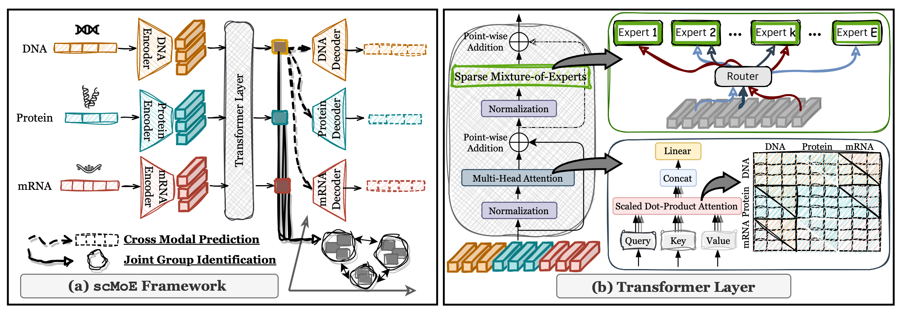

# scMoE: single-cell Multi-Modal Multi-Task Learning via Sparse Mixture-of-Experts

Official implementation for preprint "scMoE: single-cell Multi-Modal Multi-Task Learning via Sparse Mixture-of-Experts".  

- Authors: [Sukwon Yun*](https://sukwonyun.github.io/), [Jie Peng*](https://openreview.net/profile?id=~Jie_Peng4), [Namkyeong Lee](https://namkyeong.github.io/),
[Yanyong Zhang](http://staff.ustc.edu.cn/~yanyongz/),
[Chanyoung Park](https://dsail.kaist.ac.kr/professor/),
[Zunpeng Liu](https://scholar.google.com.hk/citations?user=Yk4VxGQAAAAJ&hl=en), and [Tianlong Chen](https://tianlong-chen.github.io/)

## Overview
Recent advances in measuring high-dimensional modalities, including protein levels and DNA accessibility, at the single-cell level have prompted the need for frameworks capable of handling multi-modal data while simultaneously addressing multiple tasks. Despite these ad- vancements, much of the work in the single-cell domain remains limited, often focusing on either a single-modal or single-task perspective. A few recent studies have ventured into multi- modal, multi-task learning, but we identified a 1 OptimizationConflict issue, leading to suboptimal results when integrating additional modalities, which is undesirable. Furthermore, there is a 2 Costly Interpretability challenge, as current approaches predominantly rely on costly post-hoc methods like SHAP. Motivated by these challenges, we introduce scMoE1, a novel framework that, for the first time, applies Sparse Mixture-of-Experts (SMoE) within the single-cell domain. This is achieved by incorporating an SMoE layer into a transformer block with a cross-attention module. Thanks to its design, scMoE inherently possesses mechanistic interpretability, a critical aspect for understanding underlying mechanisms when handling biological data. Furthermore, from a post-hoc perspective, we enhance interpretability by extending the concept of activation vectors (CAVs). Extensive experiments on simulated datasets, such as Dyngen, and real-world multi-modal single-cell datasets, including {DBiT-seq, Patch-seq, ATAC-seq}, demonstrate the effectiveness of scMoE.




## **Environmental Setup (Step-by-step guide to install FastMoE library)**

```
conda create -n scmoe python=3.10 -y
conda activate scmoe
conda install pytorch==2.0.1 torchvision==0.15.2 torchaudio==2.0.2 pytorch-cuda=11.7 -c pytorch -c nvidia -y
conda install nvidia::cudatoolkit conda-forge::cudatoolkit-dev -y
conda install -c conda-forge gxx=10.4 -y
export LD_LIBRARY_PATH=/path_to_anaconda3/scmoe/lib:$LD_LIBRARY_PATH
export CUDA_HOME=/path_to_anaconda3/envs/scmoe
cd src/network
git clone https://github.com/laekov/fastmoe.git 
cd fastmoe 
USE_NCCL=0 python setup.py install
conda install dm-tree scikit-learn tqdm pandas -y
conda install -c conda-forge scanpy nibabel -y
```

## Dataset
* Dataset can be downloaded here: https://zenodo.org/records/7708592


## How to Run

1. Dyngen
```
python ./scripts/train_dyngen.py
```

2. DBiT-seq
```
python ./scripts/train_dbitseq.py
```

3. Patch-seq
```
python ./scripts/train_patchseqy.py
```

4. ATAC-seq
```
python ./scripts/train_atacseq.py
```


